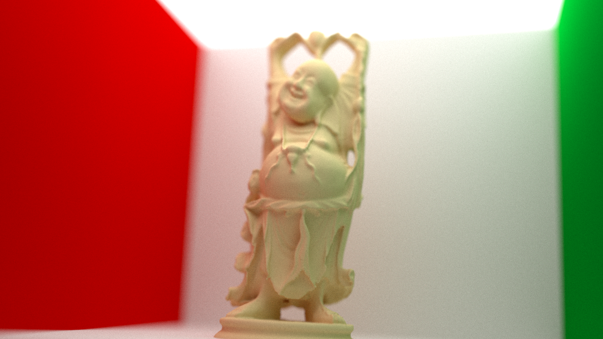

zaphod - A CPU Raytracer
======

###About###

This project is intented as a learning experience. Both to brush up my 3D math skills as well as practice writing a
piece of software in C++. Currently it runs on Windows and requires the VS2015 runtime. I may port it to other
platforms later.

May aim is it to implement a functional 3D renderer using raytracing. This includes soft shadows, mesh lights, textured
models and some more. I'll also try to keep all that in realtime, though I might sacrifice that constraint in exchange
for cool features.

<<<<<<< HEAD
=======
Download data (examples scenes) here: https://github.com/daseyb/zaphod/releases/download/1.0/data.zip

>>>>>>> 6dd27b5cfaadf75be6a0a19556ac379374fde471
###"Screenshot of the Week"###

###Progress###

May 9th 13: Hard shadows

May 9th 13: Point lights

May 10th 13: Reflections

May 14th 13: Refractions

May 21st 13: Transparent shadows

March 14th 14: Glossy Reflections

July 30th 14: Meshes and multi sampling
